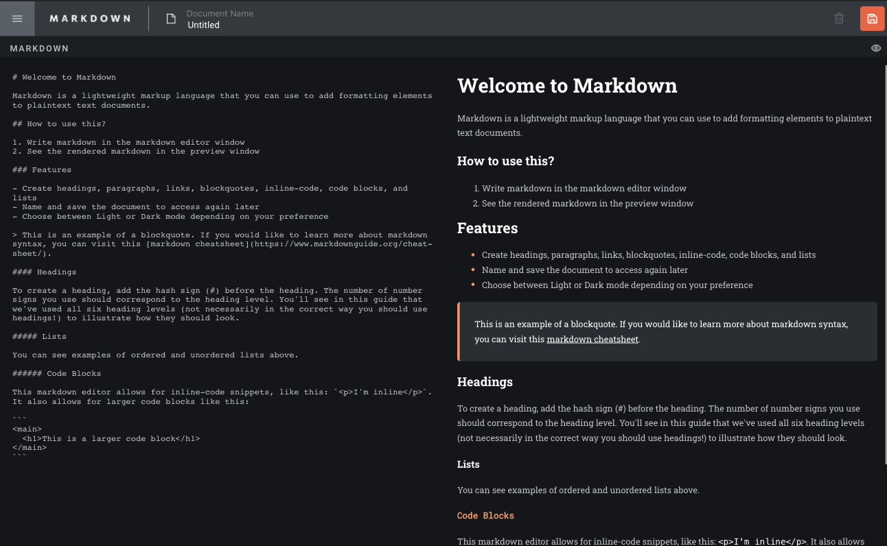

# Markdown Editor

## Features
- Light / Dark Mode
- Responsive Display (mobile, tablet, desktop)
- CRUD application

## Tech Stack

- MongoDB
- Express.js
- React.js
- Node.js

## Visuals

  
  
   
   

